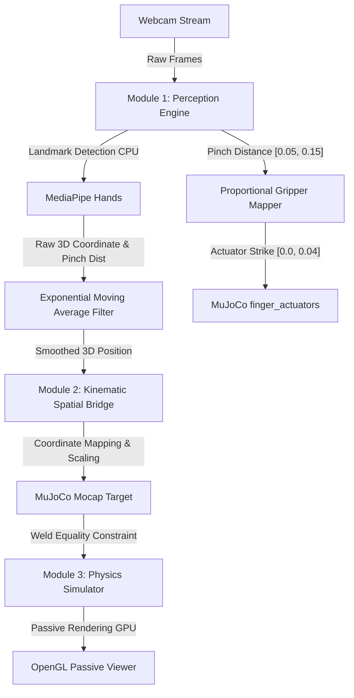

# Real-Time 3D Hand Teleoperated Robot Simulation in MuJoCo

A high-performance, modular, real-time physical AI pipeline that tracks human hand movements in 3D using a standard webcam (via **MediaPipe Hands** on CPU) and translates them into smooth teleoperation control inputs for simulated robotic platforms in **MuJoCo** (on GPU).

Developed to run at **60 FPS** with low latency, featuring support for:
- A 6-DOF **Simple Arm** (geometric)
- A 7-DOF **Franka Emika Panda** robot arm (in geometric and high-fidelity industrial variants)
- A dual-arm bimanual setup of **Shadow Hands** (E3M5 model, 48 total DOFs)

---

## 🌟 Key Features

- **CPU-Based 3D Perception**: Real-time hand landmark tracking and filtering using a standard 2D webcam feed.
- **Apparent Palm Scale as Depth Proxy**: Leverages the 2D pixel distance between the wrist and knuckles to map physical hand distance (depth) naturally to the robot's vertical elevation ($Z$ axis).
- **Proportional Gripper Control**: Maps human thumb-to-index pinch distance directly to the robot's parallel jaws, allowing precise grasps.
- **Bumpless Transfer**: Implements a smooth coordinate blending algorithm upon hand detection to prevent the robot arm from instantly snapping or crashing.
- **Frictional Stability**: Fine-tuned contact dynamics in MuJoCo (`condim="6"` with rolling & torsional friction) enabling stable picking, lifting, and placing of objects.

---

## 🗺️ System Architecture



---

## 📂 Repository Structure

```
├── .gitignore                      # Git exclusion rules
├── requirements.txt                # Python dependencies
├── README.md                       # Main landing page & quick start
├── main.py                         # Module 4: System Integrator
├── hand_tracker.py                 # Module 1: Perception Engine
├── spatial_transformer.py          # Module 2: Kinematic Spatial Bridge
├── robot_sim.py                    # Module 3: Physics Simulator
├── simple_arm.xml                  # 6-DOF geometric arm XML model
├── docs/                           # Detailed Documentation Folder
│   ├── walkthrough.md              # Technical changes and validation walkthrough
│   └── interview_prep_guide.md     # Mathematical derivations and interview prep notes
```

---

## 🚀 Quick Start

### 1. Prerequisites
- Python 3.10 or higher
- A standard USB webcam or integrated laptop webcam

### 2. Installation
Clone this repository and install the dependencies:
```bash
pip install -r requirements.txt
```

### 3. Download the Hand Landmarker Model
The Perception Engine requires the pre-trained MediaPipe Hand Landmarker model. Download it to the repository root:
*   [Download hand_landmarker.task](https://storage.googleapis.com/mediapipe-models/hand_landmarker/hand_landmarker/float16/1/hand_landmarker.task)

---

## 🎮 Running the Simulation

### Selecting the Robot Configuration
You can switch between different robot models by editing the `ROBOT_NAME` variable at the top of [main.py](file:///d:/VKS/VKSLearn/HandRobotSimMujoco/main.py):
```python
# Options: "simple_arm", "franka_panda_geometric", "franka_panda_industrial", "shadow_hand_dual"
ROBOT_NAME = "shadow_hand_dual"
```

### Running the Orchestrator
Execute the main script:
```bash
python main.py
```

### Control Scheme by Configuration

#### 1. Franka Panda / Simple Arm (Single-Hand Control)
- **Arm translation**: Move your hand in 3D space. Left/right/up/down maps to 3D space, and palm scale (distance to camera) maps to Z (depth).
- **Gripper control**: Pinch your thumb and index finger to close/open the gripper jaws.

#### 2. Bimanual Shadow Hands (`shadow_hand_dual`)
- **Bimanual wrist tracking**: Both left and right hands are tracked independently using 3D coordinate mapping. Moving your hands translates the left/right Shadow Hands in the simulation.
- **Dexterous finger flexion**: For each hand, MediaPipe tracks all 5 fingers. The perception engine computes normalized 3D flexion/curling metrics (0.0 for open, 1.0 for closed) which are mapped directly to the 40 independent position actuators of the simulated hands.
- **Object interaction**: You can use fingers to curl, pinch, and manipulate objects (e.g., cubes) in the simulation.

#### General Controls
- **Exit**: Press `q` in the camera/CV2 window or close the MuJoCo window to exit.

### Running Individual Module Tests
You can verify each system layer independently:

*   **Perception Engine Test**:
    ```bash
    python hand_tracker.py
    ```
*   **Spatial Transformer Test**:
    ```bash
    python spatial_transformer.py
    ```
*   **Physics Simulator Test**:
    ```bash
    python robot_sim.py
    ```

---

## 📖 Deep-Dive Documentation

For more in-depth explanations on the math, algorithms, physics configurations, and design details:
- See the [Implementation & Code Walkthrough](file:///d:/VKS/VKSLearn/HandRobotSimMujoco/docs/walkthrough.md)
- Read the [Mathematical Derivations & Interview Prep Notes](file:///d:/VKS/VKSLearn/HandRobotSimMujoco/docs/interview_prep_guide.md)
