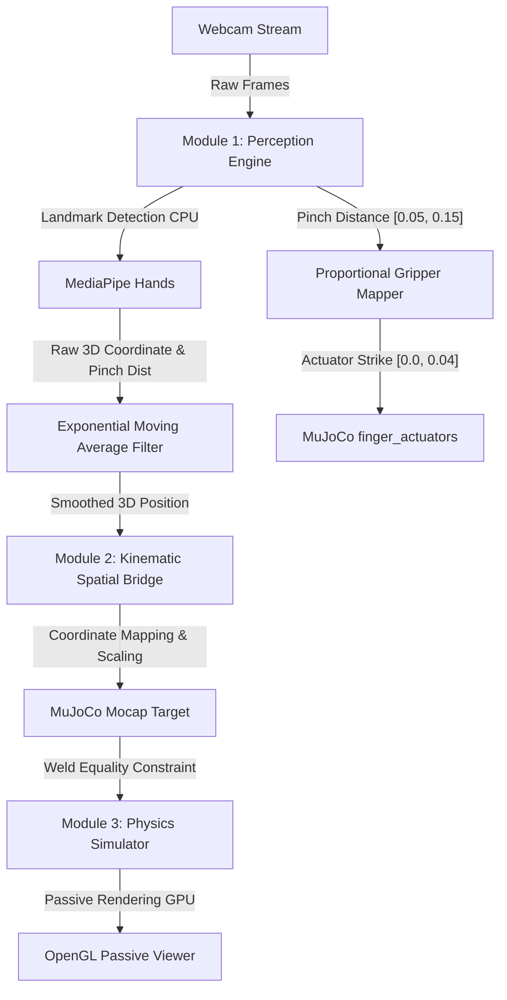

# Real-Time 3D Hand Teleoperated Robot Simulation in MuJoCo

A high-performance, modular, real-time physical AI pipeline that tracks human hand movements in 3D using a standard webcam (via **MediaPipe Hands** on CPU) and translates them into smooth teleoperation control inputs for a simulated robot arm in **MuJoCo** (on GPU).

Developed to run at **60 FPS** with low latency, featuring support for both a 6-DOF simple arm and a 7-DOF **Franka Emika Panda** robot with parallel sliding jaws.

---

## 🌟 Key Features

- **CPU-Based 3D Perception**: Real-time hand landmark tracking and filtering using a standard 2D webcam feed.
- **Apparent Palm Scale as Depth Proxy**: Leverages the 2D pixel distance between the wrist and knuckles to map physical hand distance (depth) naturally to the robot's vertical elevation ($Z$ axis).
- **Proportional Gripper Control**: Maps human thumb-to-index pinch distance directly to the robot's parallel jaws, allowing precise grasps.
- **Bumpless Transfer**: Implements a smooth coordinate blending algorithm upon hand detection to prevent the robot arm from instantly snapping or crashing.
- **Frictional Stability**: Fine-tuned contact dynamics in MuJoCo (`condim="6"` with rolling & torsional friction) enabling stable picking, lifting, and placing of objects.

---

## 🗺️ System Architecture



---

## 📂 Repository Structure

```
├── .gitignore                      # Git exclusion rules
├── requirements.txt                # Python dependencies
├── README.md                       # Main landing page & quick start
├── main.py                         # Module 4: System Integrator
├── hand_tracker.py                 # Module 1: Perception Engine
├── spatial_transformer.py          # Module 2: Kinematic Spatial Bridge
├── robot_sim.py                    # Module 3: Physics Simulator
├── simple_arm.xml                  # 6-DOF geometric arm XML model
├── docs/                           # Detailed Documentation Folder
│   ├── walkthrough.md              # Technical changes and validation walkthrough
│   └── interview_prep_guide.md     # Mathematical derivations and interview prep notes
```

---

## 🚀 Quick Start

### 1. Prerequisites
- Python 3.10 or higher
- A standard USB webcam or integrated laptop webcam

### 2. Installation
Clone this repository and install the dependencies:
```bash
pip install -r requirements.txt
```

### 3. Download the Hand Landmarker Model
The Perception Engine requires the pre-trained MediaPipe Hand Landmarker model. Download it to the repository root:
*   [Download hand_landmarker.task](https://storage.googleapis.com/mediapipe-models/hand_landmarker/hand_landmarker/float16/1/hand_landmarker.task)

---

## 🎮 Running the Simulation

### Integrated Teleoperation (Default: Franka Panda)
Run the main pipeline orchestrator:
```bash
python main.py
```
- **Control**: Move your hand left/right to move the robot left/right. Move your hand closer to the camera to descend, and further away to rise.
- **Gripper**: Pinch your thumb and index finger together to close the gripper jaws on the cubes, and release to open.
- **Exit**: Press `q` in the webcam frame or close the MuJoCo window to exit.

### Running Individual Module Tests
You can verify each system layer independently:

*   **Perception Engine Test**:
    ```bash
    python hand_tracker.py
    ```
*   **Spatial Transformer Test**:
    ```bash
    python spatial_transformer.py
    ```
*   **Physics Simulator Test**:
    ```bash
    python robot_sim.py
    ```

---

## 📖 Deep-Dive Documentation

For more in-depth explanations on the math, algorithms, physics configurations, and design details:
- See the [Implementation & Code Walkthrough](file:///d:/VKS/VKSLearn/HandRobotSimMujoco/docs/walkthrough.md)
- Read the [Mathematical Derivations & Interview Prep Notes](file:///d:/VKS/VKSLearn/HandRobotSimMujoco/docs/interview_prep_guide.md)
