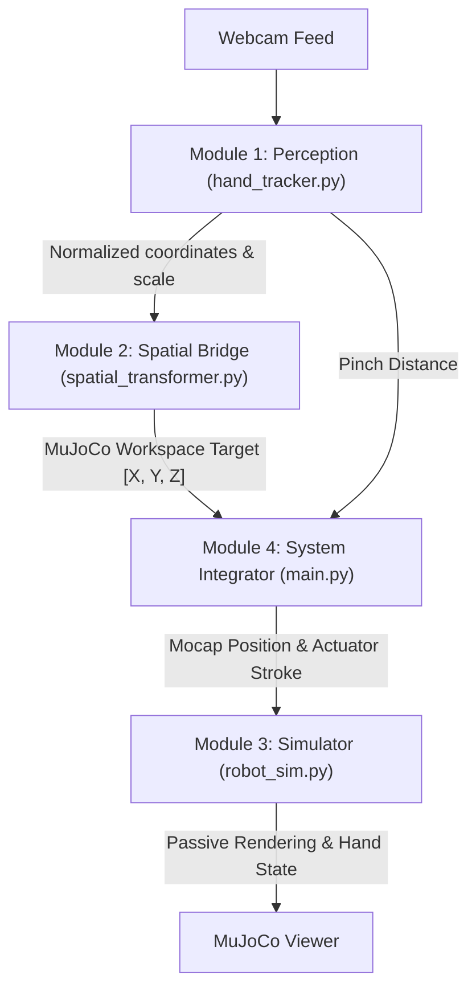

# Interview Preparation Guide: Hand Teleoperated Robot Sim

This guide prepares you for interview-style questions on the system's architecture, mathematical foundation, and implementation details.

---

## 1. System Architecture Overview
The codebase is structured as a modular real-time teleoperation pipeline consisting of four core components:

---

## 2. Key Modules & Technical Deep-Dive

### Module 1: Perception Engine ([hand_tracker.py](file:///d:/VKS/VKSLearn/HandRobotSimMujoco/hand_tracker.py))
*   **Technology**: MediaPipe Tasks HandLandmarker API running strictly on CPU.
*   **Key Algorithms**:
    *   **Exponential Moving Average (EMA)** filter: Smooths out high-frequency sensor noise and hand tremors without introducing excessive latency.
        $$x_{\text{filtered}} = \alpha \cdot x_{\text{raw}} + (1 - \alpha) \cdot x_{\text{filtered\_prev}}$$
    *   **Depth Proxy calculation**: Maps the 2D pixel distance between the Wrist (landmark 0) and Middle MCP (landmark 9) to a continuous depth value:
        $$d_{\text{palm}} = \|\mathbf{p}_{\text{wrist}} - \mathbf{p}_{\text{mcp}}\|_2$$

### Module 2: Kinematic Spatial Bridge ([spatial_transformer.py](file:///d:/VKS/VKSLearn/HandRobotSimMujoco/spatial_transformer.py))
*   **Concept**: 4x4 Homogeneous Transformation Matrix ($T$) to map points from the MediaPipe normalized frame to MuJoCo simulation coordinates.
*   **Key Equation**:
    $$P_{\text{mujoco}} = T \cdot P_{\text{mediapipe}}$$
    Swaps axes (MediaPipe -Y maps to MuJoCo X, and -X maps to MuJoCo Y) and applies axis-specific scaling and translation bounds.

### Module 3: Physics Simulator ([robot_sim.py](file:///d:/VKS/VKSLearn/HandRobotSimMujoco/robot_sim.py))
*   **Technology**: MuJoCo Python bindings.
*   **Concepts**:
    *   **Mocap body integration**: Translating target hand coordinates directly to a virtual "mocap" target.
    *   **Weld constraints**: Linking the robot's physical end-effector (hand) to the mocap target body to compute inverse kinematics implicitly.

### Module 4: System Integrator ([main.py](file:///d:/VKS/VKSLearn/HandRobotSimMujoco/main.py))
*   **Concepts**:
    *   **Bumpless Transfer**: Uses linear interpolation blending on startup to prevent the robot arm from instantly snapping to a newly detected hand coordinate.
    *   **Proportional Gripper Control**: Maps continuous hand pinching distance to the robot's sliding jaw actuators.

---

## 3. Anticipated Technical Questions & Answers
1. **Perception**: *Why use EMA instead of a Kalman Filter?*
   - *Answer*: Kalman filters require a detailed state transition/motion model and are computationally heavy. EMA is extremely low-latency, computationally cheap (O(1)), and requires only a single parameter $\alpha$ to tune real-time human-in-the-loop control smoothly.
2. **Kinematics**: *How does the weld constraint solve Inverse Kinematics (IK)?*
   - *Answer*: Instead of solving numerical or analytical IK in Python and facing singularities or joint limits, we define virtual mocap bodies. MuJoCo's constraint solver handles the alignment of the robot end-effector to the mocap body implicitly, accounting for physics, joint boundaries, and collision constraints at the solver level.
3. **Control**: *What is "bumpless transfer" and why does it prevent simulation crashes?*
   - *Answer*: It smoothly interpolates the starting position of the robot to the human hand's target pose over a brief transition window (e.g., 1.5 seconds) upon first detection. This prevents instantaneous step inputs that cause high force/acceleration spikes and blow up the integrator.
4. **XML Namespace/Prefixing**: *How do you load two identical robots without naming collisions in MuJoCo?*
   - *Answer*: MuJoCo requires all body, joint, geom, site, and actuator names to be unique. We implemented a recursive XML parser/transformer that prefixes all classes, childclasses, and material/mesh references with `lh_` or `rh_`, allowing the compiler to successfully build a bimanual workspace with shared mesh assets.

---

## 4. Scalable Physical AI Architecture Talking Points

### Pillar 1: Decentralized, Commodity-Grade Data Collection
*   **Strategic Frame**: Traditional data collection relies on expensive teleoperation setups (e.g., leader-follower hardware rigs, VR controllers, or optical motion capture suits). This is a massive bottleneck for scaling robot foundation models.
*   **Talking Point**: *"By utilizing consumer-grade webcams and lightweight CPU-based landmark tracking, we unlock decentralized, crowdsourced demonstration collection. Using **apparent palm scale as a scale-invariant depth proxy** and **normalizing finger flexions by the palm length** makes the perception engine completely invariant to camera intrinsics, distance, or the user's hand size. This enables any crowd worker to collect high-fidelity manipulation data on a standard laptop without hardware calibration."*

### Pillar 2: Physics-Engine-in-the-Loop Data Verification and Cleaning
*   **Strategic Frame**: Raw visual tracking data is noisy, contains self-collisions, and violates physical joint limits, making it "dirty" and unusable for training.
*   **Talking Point**: *"We don't just record raw human hand coordinates; we pass them through a physics-based simulation constraint layer (weld constraints and joint ranges in MuJoCo). The simulator acts as an implicit, real-time data cleaner. If the human hand performs a movement that is physically impossible or causes interpenetration, the simulation engine resolves it according to rigid body dynamics. Furthermore, we can automatically discard trials where the accumulated constraint forces or joint velocities exceed normal thresholds, ensuring 100% clean, 'sim-ready' training trajectories (`qpos`, `qvel`, `ctrl`, `contact_forces`)."*

### Pillar 3: Modular, Platform-Agnostic Spatial Mapping
*   **Strategic Frame**: Custom-coded mapping scripts for different robots lead to technical debt and slow down iteration when onboarding new hardware.
*   **Talking Point**: *"Our Kinematic Spatial Bridge uses generic Homogeneous Transformation Matrices to decouple raw coordinates from the robot workspace. We successfully demonstrated this plug-and-play architecture by using the exact same perception frontend to control a simple 6-DOF geometric arm, a 7-DOF industrial Franka Panda arm, and a 48-DOF bimanual Shadow Hand setup. Adding a new robot requires zero changes to the perception tracking; it is just a declarative asset config."*

### Pillar 4: Training-Ready Output for Foundation Models
*   **Strategic Frame**: Models like Diffusion Policies or RT-1/RT-2 require multimodal state-action pairs.
*   **Talking Point**: *"The pipeline outputs synchronized, high-frequency (60Hz) logs of egocentric user video, synthetic simulator views, joint state trajectories (`qpos`, `qvel`), and control commands (`ctrl`). This data is structured and immediately ready for imitation learning (Behavior Cloning) or offline reinforcement learning."*

---

## 5. Strategic Questions to Ask the CEO (Sarthak)
To showcase your depth as a Physical AI Architect, ask questions that address high-level engineering tradeoffs:
1. **Infrastructure/Distribution**: *"To scale egocentric data collection to thousands of crowd workers, are you exploring web-based simulation tools (like WebGL/WebAssembly MuJoCo) to run directly in the browser, or are we packaging containerized (Docker/GUI) environments for desktop workers?"*
2. **Domain Randomization & Sim-to-Real**: *"How do we plan to handle visual domain randomization for egocentric datasets? Are we focusing on synthetic asset rendering (generating variations in MuJoCo textures/lighting) or training visual representations on real-world egocentric videos and aligning them with simulation states?"*
3. **Data Quality & Filtering at Scale**: *"With crowdsourced teleoperation, what is the target ratio of automated filtering (e.g., physics-based constraint checking, self-collision detection) versus human-in-the-loop QA? How do we scale the automated filtering of unstable contacts or slippery grasps?"*
