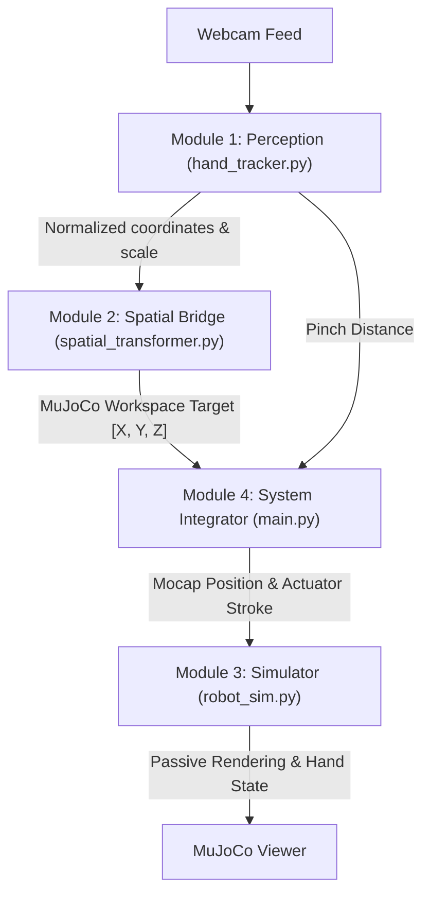

# Interview Preparation Guide: Hand Teleoperated Robot Sim

This guide prepares you for interview-style questions on the system's architecture, mathematical foundation, and implementation details.

---

## 1. System Architecture Overview
The codebase is structured as a modular real-time teleoperation pipeline consisting of four core components:

---

## 2. Key Modules & Technical Deep-Dive

### Module 1: Perception Engine ([hand_tracker.py](file:///d:/VKS/VKSLearn/HandRobotSimMujoco/hand_tracker.py))
*   **Technology**: MediaPipe Tasks HandLandmarker API running strictly on CPU.
*   **Key Algorithms**:
    *   **Exponential Moving Average (EMA)** filter: Smooths out high-frequency sensor noise and hand tremors without introducing excessive latency.
        $$x_{\text{filtered}} = \alpha \cdot x_{\text{raw}} + (1 - \alpha) \cdot x_{\text{filtered\_prev}}$$
    *   **Depth Proxy calculation**: Maps the 2D pixel distance between the Wrist (landmark 0) and Middle MCP (landmark 9) to a continuous depth value:
        $$d_{\text{palm}} = \|\mathbf{p}_{\text{wrist}} - \mathbf{p}_{\text{mcp}}\|_2$$

### Module 2: Kinematic Spatial Bridge ([spatial_transformer.py](file:///d:/VKS/VKSLearn/HandRobotSimMujoco/spatial_transformer.py))
*   **Concept**: 4x4 Homogeneous Transformation Matrix ($T$) to map points from the MediaPipe normalized frame to MuJoCo simulation coordinates.
*   **Key Equation**:
    $$P_{\text{mujoco}} = T \cdot P_{\text{mediapipe}}$$
    Swaps axes (MediaPipe -Y maps to MuJoCo X, and -X maps to MuJoCo Y) and applies axis-specific scaling and translation bounds.

### Module 3: Physics Simulator ([robot_sim.py](file:///d:/VKS/VKSLearn/HandRobotSimMujoco/robot_sim.py))
*   **Technology**: MuJoCo Python bindings.
*   **Concepts**:
    *   **Mocap body integration**: Translating target hand coordinates directly to a virtual "mocap" target.
    *   **Weld constraints**: Linking the robot's physical end-effector (hand) to the mocap target body to compute inverse kinematics implicitly.

### Module 4: System Integrator ([main.py](file:///d:/VKS/VKSLearn/HandRobotSimMujoco/main.py))
*   **Concepts**:
    *   **Bumpless Transfer**: Uses linear interpolation blending on startup to prevent the robot arm from instantly snapping to a newly detected hand coordinate.
    *   **Proportional Gripper Control**: Maps continuous hand pinching distance to the robot's sliding jaw actuators.

---

## 3. Anticipated Interview Questions
1. **Perception**: *Why use EMA instead of a Kalman Filter?* (Kalman filter requires a state transition model and is computationally heavier; EMA is computationally cheap, single-parameter $\alpha$, and extremely low latency for real-time loops).
2. **Kinematics**: *How does the weld constraint solve Inverse Kinematics (IK)?* (Instead of doing numerical IK in Python, MuJoCo's solver handles constraint satisfaction internally by applying virtual forces to align the hand body to the mocap body).
3. **Control**: *What is "bumpless transfer" and why does it prevent simulation crashes?* (It blends the starting position of the robot with the hand position over a short window, preventing instantaneous position step inputs that cause high force/acceleration spikes).
